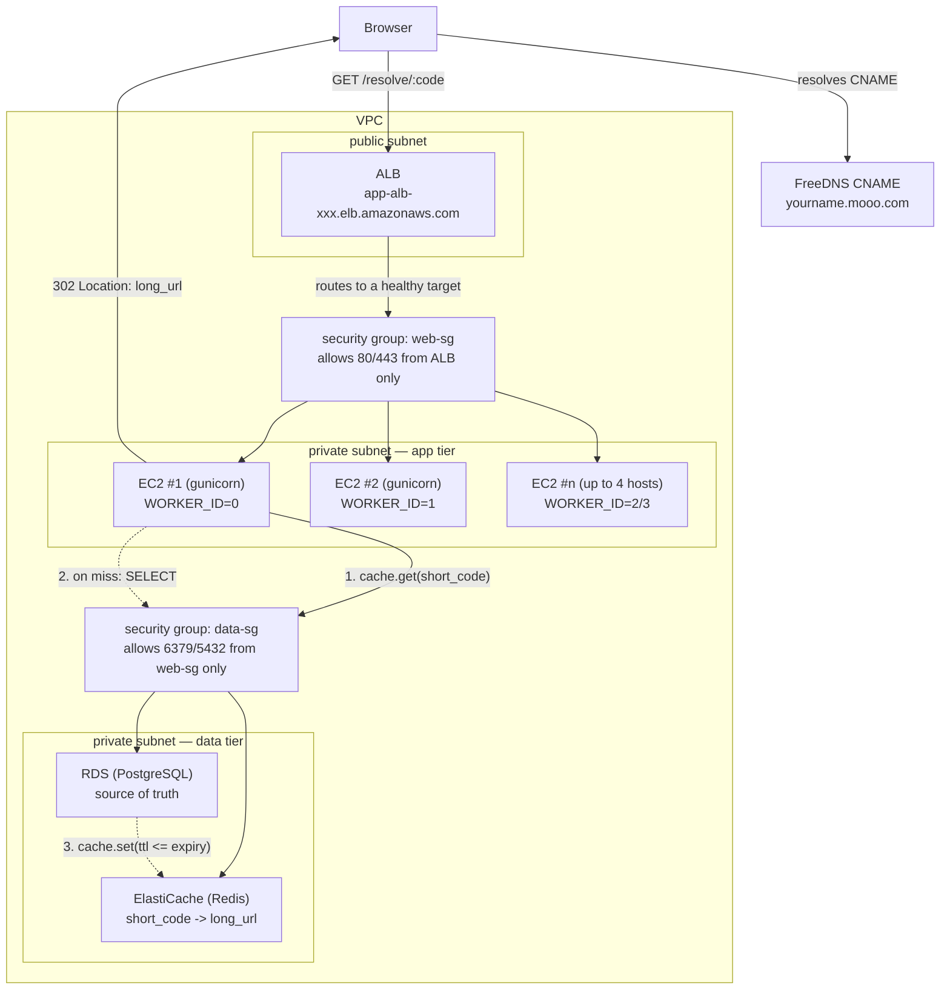

# Deployment architecture

One VPC, public ALB, private app/data tier. This is the path a resolve request (`GET /api/v1/resolve/<short_code>/`) takes end to end.

The `web-sg` and `data-sg` boxes are AWS security groups, not hosts — they're the actual firewall rule that enforces the public/private split: `web-sg` only accepts inbound traffic from the ALB, and `data-sg` only accepts inbound traffic from instances in `web-sg`. Nothing outside those chains can reach the app or the data tier directly, regardless of subnet routing.

## Why each piece is there

1. **CNAME, not an A record** — the ALB's IPs aren't stable, so DNS must point at its DNS name and let AWS resolve the current IPs underneath.
2. **Public vs. private subnet** — only the ALB has a route to/from the internet; the app, cache, and DB stay unreachable except via security-group rules from the tier above them.
3. **Per-host `WORKER_ID` (0-3)** — the snowflake short-code generator (`shortner/snowflake.py`) reserves 2 bits for machine identity; each EC2 host needs a distinct value so two hosts can never mint the same short code at the same millisecond.
4. **Cache-aside, not write-through** — a write (`URL.save()`) invalidates the Redis key rather than updating it, so a resolve always either hits a fresh cache entry or repopulates one from RDS — never serves a value written before the last save.
